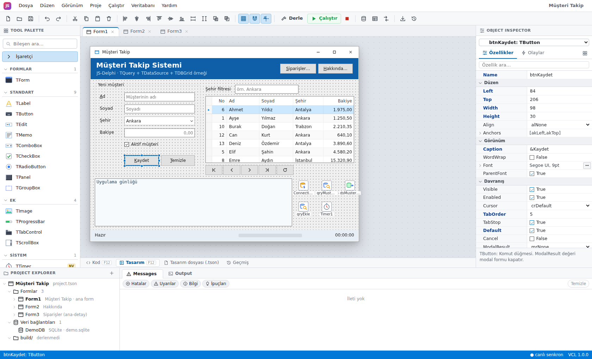
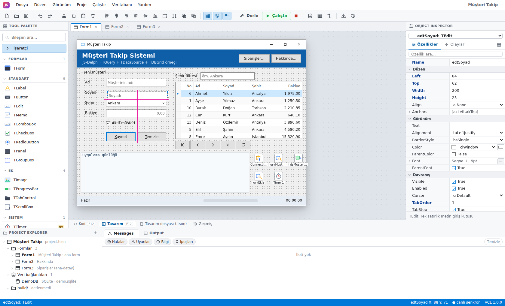
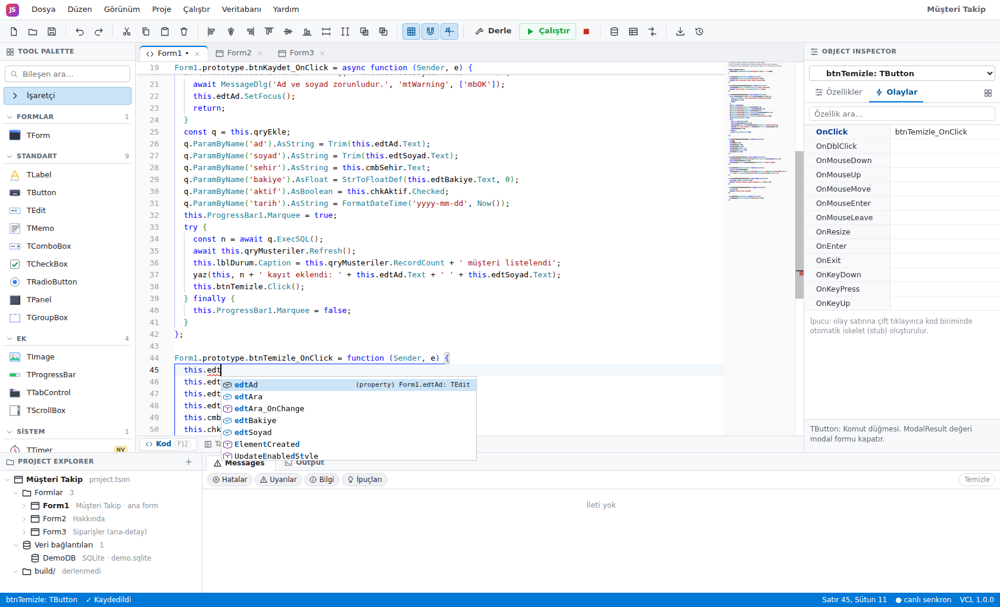
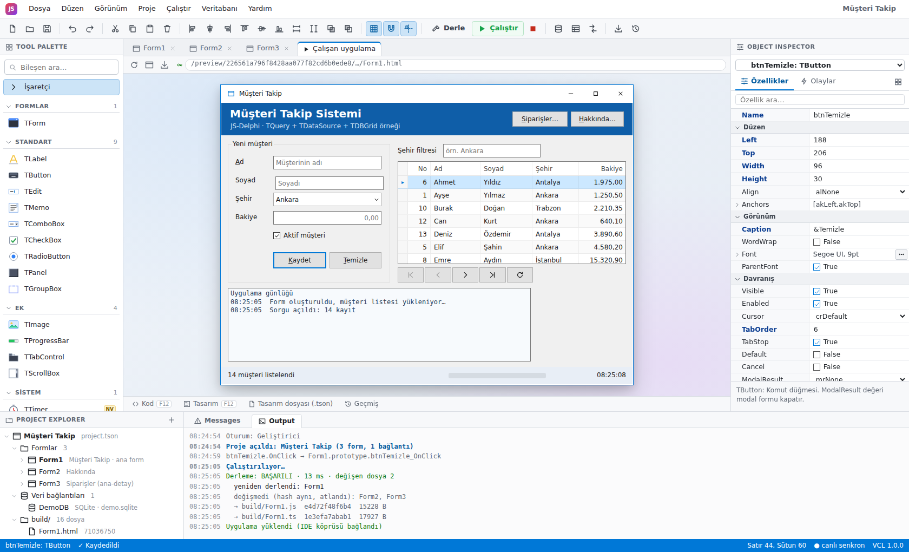
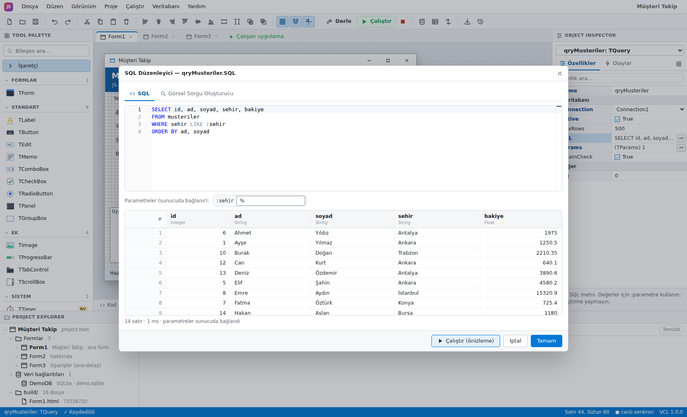
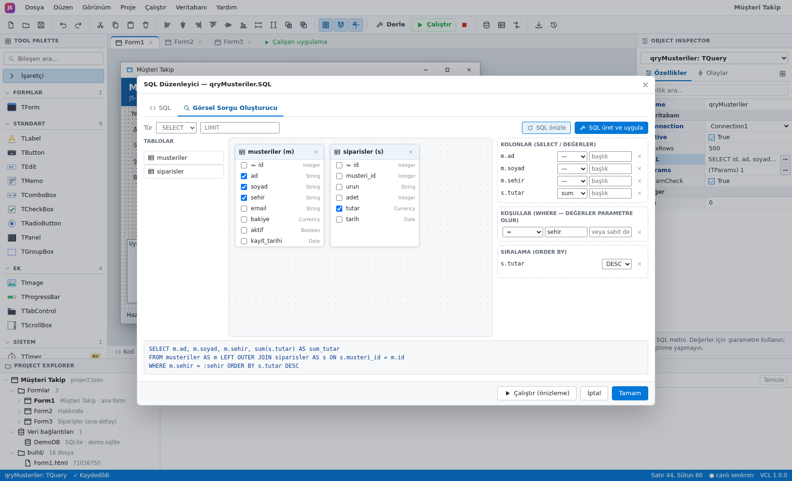
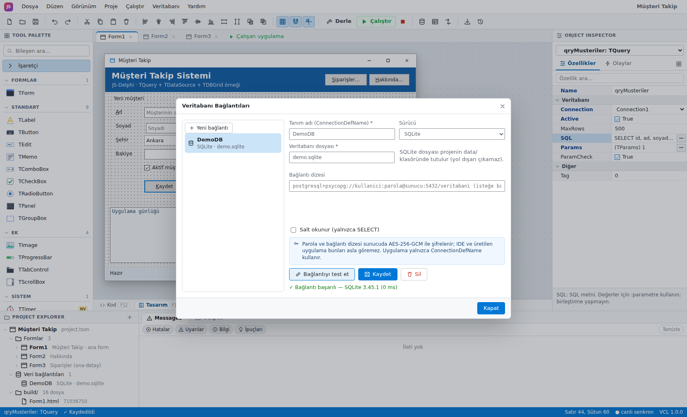
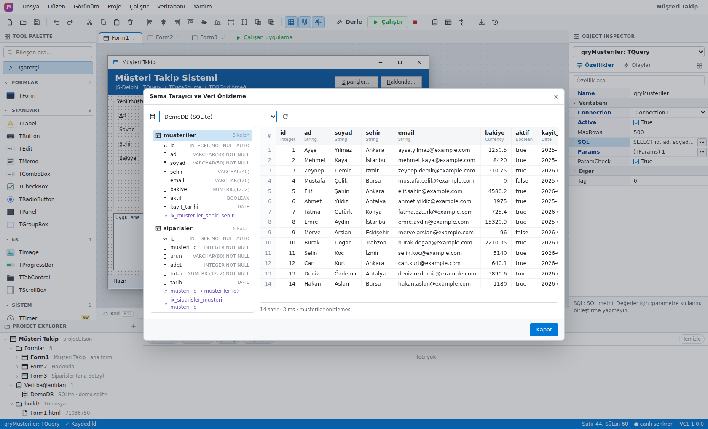
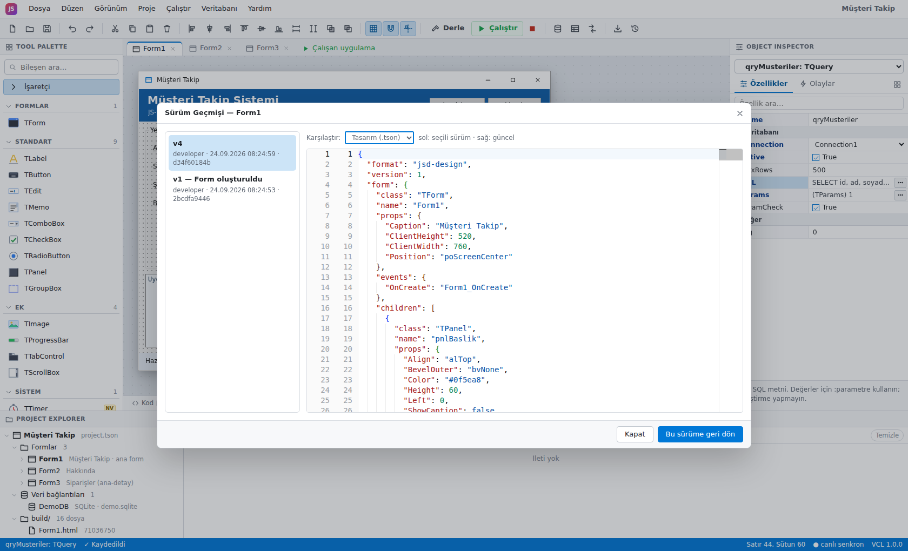
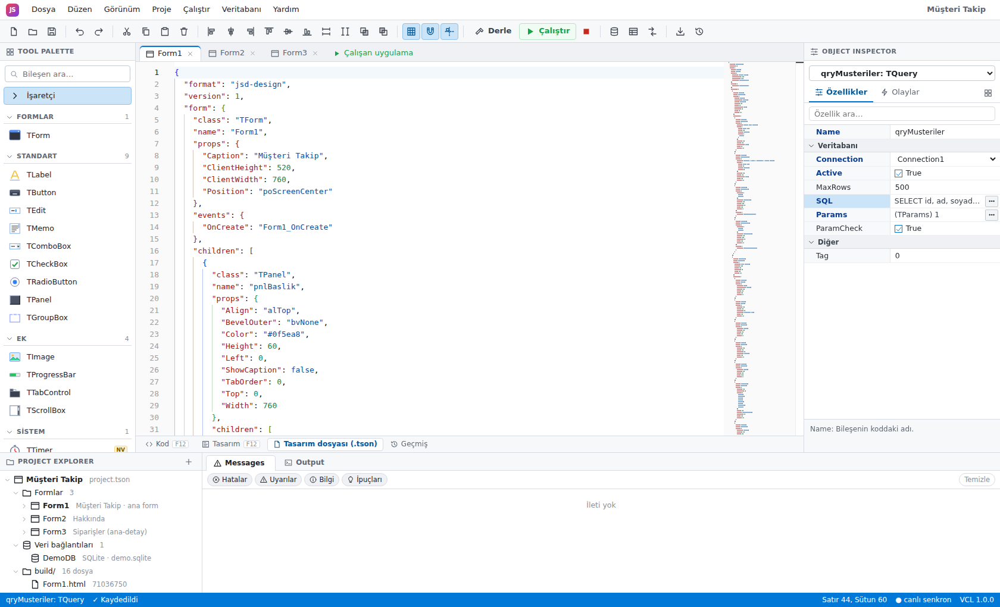

# JS-Delphi — Tarayıcıda Delphi RAD IDE

Delphi'nin "formu çiz → olayı çift tıkla → kodu yaz → F9" felsefesini tarayıcıya taşıyan web IDE.
Görsel form tasarımcısı, Object Inspector, Monaco kod editörü, veri erişim bileşenleri
(TConnection / TQuery / TTable / TDataSource / TDBGrid), görsel sorgu oluşturucu, migration'lar,
sürüm geçmişi ve çok kullanıcılı canlı senkron tek pakette.



## Hızlı başlangıç

```bash
make install   # .venv + pip + npm install
make run       # IDE'yi derler ve http://127.0.0.1:8000 adresinde sunar
```

İlk açılışta "Müşteri Takip" demo projesi (SQLite veritabanı, 3 form, ana-detay örneği) otomatik oluşturulur.
Geliştirme için `make dev` backend'i `--reload` ile, Vite'ı http://127.0.0.1:5173 adresinde birlikte başlatır.
Tüm hedefler: `make help`.

| Hedef | Açıklama |
|---|---|
| `make install` / `make install-db` | Bağımlılıklar / isteğe bağlı PostgreSQL, MySQL, MariaDB, MSSQL, MongoDB sürücüleri |
| `make run` · `make serve` | Derle + çalıştır · yalnızca çalıştır |
| `make dev` · `make backend` · `make frontend` | Geliştirme sunucuları |
| `make runtime` | `vcl.ts` → `vcl.js`, `vcl.d.ts`, `vcl.manifest.json` |
| `make test` · `make typecheck` · `make check` | Testler ve tip denetimi |
| `make screenshots` | Çalışan sunucudan `docs/screenshots/*.png` üretir |

Gereksinimler: Python 3.11+, Node.js 20.19+ veya 22.12+ (Vite 8).

## Ekran görüntüleri

| | |
|---|---|
|  Hizalama kılavuzları, grid'e yapışma |  Olay çift tıklama → stub, IntelliSense |
|  F9: sandbox iframe önizleme + Output |  SQL editörü, parametreler sunucuda bağlanır |
|  Sürükle-bırak görsel sorgu oluşturucu |  Bağlantı yöneticisi (AES-256-GCM) |
|  Şema tarayıcı (PK/FK/index) + veri önizleme |  Sürüm geçmişi ve diff |
|  `Form1.design.tson` (dfm karşılığı) | |

## Mimari

```
┌──────────────────────────── Tarayıcı (Vite + TypeScript, framework yok) ────────────────────────────┐
│ ToolPalette │ FormDesigner (Shadow DOM, gerçek VCL bileşenleri) │ ObjectInspector (RTTI'dan)         │
│ ProjectExplorer · Messages · Output       CodeEditor (tek Monaco, sekme başına model)              │
│ ProjectModel/FormDoc: undo/redo, 300 ms debounce kayıt, 409 → last-writer-wins, WS canlı senkron   │
└──────────────── REST /api/* · WS /ws/{id} · sandbox iframe /preview/{id}/{token}/ ─────────────────┘
┌──────────────────────────────────── FastAPI (sabit Python backend) ────────────────────────────────┐
│ ProjectService · FileService · TemplateService (Jinja2) · BuildService · SyncHub                   │
│ Data: ConnectionManager (AES) · QueryService (allow-list proxy) · QueryBuilder · Migrations        │
│ SQLite metadata: projeler, form JSON'ları, kod, revizyonlar, build hash'leri, izinli SQL listesi   │
└────────────────────────────────────────────────────────────────────────────────────────────────────┘
```

**Tek runtime, iki kullanım (WYSIWYG).** `backend/runtime/vcl.ts`, `TComponent → TControl → TWinControl`
hiyerarşisini, RTTI kaydını (`RegisterClass`), Delphi Align/Anchors algoritmalarını, `TForm`, standart
kontroller, veri kümeleri ve diyaloglarla birlikte içerir. Tasarımcı formu **aynı `TForm` sınıfıyla**
`csDesigning` durumunda çizer; derlenen uygulama aynı sınıfı çalışma zamanında kullanır. Runtime
**üretilmez, kopyalanır**. Object Inspector'daki özellik/olay listeleri, kategoriler ve ipuçları runtime'ın
RTTI'ından gelir; Python tarafı aynı bilgiyi `vcl.manifest.json` üzerinden doğrular.

**Python JS yazmaz.** `BuildService` yalnızca doğrular ve birleştirir: `flatten_design()` tasarım ağacını
manifest'e göre denetler (sınıf, özellik türü, sınır, isim çakışması), Jinja2 şablonları
(`backend/templates/*.j2`) bu düz listeyi `FormN.js` / `FormN.ts` / `FormN.html` dosyalarına yerleştirir,
kullanıcının birim kodu olduğu gibi `//#region unit` bloğuna eklenir.

```
Form1.design.tson ──flatten_design──▶ FlatForm ──form.js.j2──▶ build/Form1.js ┐
forms/Form1.ts ─────(sucrase, IDE'de)─▶ code_js ─────────────────────────────┤──▶ Form1.html + app.js
vcl.ts ──esbuild──▶ vcl.js (kopyalanır) ──────────────────────────────────────┘    index.html (menü)
```

Üretilen `build/Form1.js`'ten bir parça:

```js
export class Form1 extends TForm {
  InitializeComponent() {
    const f = this;
    f.Caption = "M\u00fc\u015fteri Takip";      // to_ts_literal: whitelist escape
    // …
    const c16 = f.btnKaydet = new TButton(f);
    c16.Name = "btnKaydet";
    c16.Parent = f.grpKayit;
    c16.Caption = "\u0026Kaydet";
    c16.Default = true;
    // …
    f.BindEvent(c16, "OnClick", "btnKaydet_OnClick");
  }
}
//#region unit: forms/Form1.ts
Form1.prototype.btnKaydet_OnClick = async function (Sender, e) { … };
//#endregion
```

### Dizin yapısı

```
backend/
  main.py, config.py, db.py, models.py, schemas.py, security.py, deps.py
  routers/     auth, projects, forms, build, runtime, preview, database, ws
  services/    project_service, file_service, template_service, build_service, design, sync_service, seed
  services/data/  connection_manager, drivers, adapters/{sql,mongo}, query_service, query_builder,
                  migrations, introspection, sql_safety
  runtime/     vcl.ts (kaynak) · vcl.css · vcl.js/vcl.d.ts/vcl.manifest.json (make runtime)
  templates/   form.js.j2, form.ts.j2, form.html.j2, app.js.j2, index.html.j2, …
  tests/
frontend/
  ts/          ide.ts · designer/ · inspector/ · editor/ · palette/ · explorer/ · preview/ · data/ · model/ · api/
  css/ide.css · vendor/monaco · scripts/{build-runtime,screenshots}.mjs
projects/<id>/  project.tson · forms/FormN.design.tson · forms/FormN.ts · build/ · assets/ · data/
```

### Tasarım dosyası (`FormN.design.tson`)

Delphi `.dfm`'nin sürüm kontrolüne uygun JSON karşılığı: anahtarlar sıralı, varsayılan değerler yazılmaz,
bileşen ağacı `children` ile iç içe, olaylar `events` altında isim → handler eşlemesidir. Veritabanında
(SQLite) JSON blob olarak saklanır ve her kayıtta proje dizinine atomik olarak yazılır.

## API

| Metot | Yol | Açıklama |
|---|---|---|
| GET/POST | `/api/projects` | Liste / oluştur (`template: blank\|demo`) |
| GET/PUT/DELETE | `/api/projects/{id}` | Proje |
| GET/POST/PUT/DELETE | `/api/projects/{id}/forms[/{form_id}]` | Formlar (`base_version` ile iyimser kilit) |
| GET/POST | `/api/projects/{id}/forms/{form_id}/revisions[/{rev}/restore]` | Sürüm geçmişi |
| POST | `/api/projects/{id}/build` · `/run` · `/export` | Artımlı derleme · çalıştırma token'ı · zip |
| GET | `/api/runtime/vcl.ts` · `vcl.css` · `vcl.js` · `vcl.d.ts` | Sabit runtime |
| GET | `/preview/{id}/{token}/{dosya}` | Derlenmiş uygulama (sandbox iframe) |
| WS | `/ws/{id}` | Canlı senkron: kayıtlar, seçimler, katılımcılar |
| * | `/api/db/connections[/{cid}]`, `/api/db/{cid}/test`, `/schema`, `/tables/{t}/preview` | Bağlantılar ve şema |
| POST | `/api/db/{cid}/query` · `/table` · `/proc` | Runtime veri proxy'si |
| POST | `/api/db/{cid}/query-builder` · `/migrations[/upgrade\|downgrade\|sql]` | Sorgu oluşturucu, migration |

Etkileşimli belge: http://127.0.0.1:8000/docs

## Güvenlik

- **XSS:** kullanıcıdan gelen her string `to_ts_literal` ile **whitelist** kaçışından geçer
  (`[A-Za-z0-9 _-.,:;!?()[]{}+*=%#@^~|$/]` dışındaki her karakter `\uXXXX`); isimler ayrıca `ident`
  filtresiyle yeniden doğrulanır. Tasarım değerleri manifest'e göre tür/sınır denetiminden geçer.
- **Dosya sistemi:** tüm yollar `lock_path()` ile `Path.resolve` sonrası proje köküne kilitlenir; yazmalar atomiktir.
- **Bağlantı bilgileri:** parola ve bağlantı dizesi **AES-256-GCM** ile şifrelenir (AAD = bağlantı kimliği,
  anahtar `JSD_MASTER_KEY` veya `data/master.key`). API parolayı ve bağlantı dizesini hiçbir zaman
  döndürmez (yalnızca sürücü, sunucu, veritabanı, kullanıcı adı); üretilen uygulama yalnızca `ConnectionDefName` bilir.
- **Veri proxy'si:** tüm sorgular backend üzerinden, **zorunlu parametre bağlama** ile çalışır; tek ifade
  kuralı, DDL yasağı, zaman aşımı ve satır sınırı uygulanır. Çalışan uygulama yalnızca son derlemede
  tasarımda bulunan SQL'leri (normalize edilmiş özet ile allow-list) çalıştırabilir.
- **Önizleme:** `sandbox="allow-scripts"` iframe (opak origin, çerez yok), kısa ömürlü imzalı run token,
  `script-src 'self'` CSP, `postMessage` köprüsünde kaynak doğrulaması.

## Performans

- Tasarımcı değişiklikleri 300 ms debounce ile kaydedilir; kod yazımı 700 ms.
- Monaco: tek editör örneği, sekme değişiminde model dispose edilmez (görünüm durumu korunur).
- Artımlı derleme: form başına girdi hash'i (tasarım + birim + şablonlar + runtime); değişmeyen formlar atlanır.

## Yol haritası

Data Module · Component Writer (kullanıcı bileşenleri) · form kalıtımı · canlı önizleme (hot reload) ·
CRDT tabanlı eşzamanlı düzenleme · iframe hata ayıklayıcı (breakpoint) · i18n · tema editörü ·
bileşen mağazası · Tauri/Electron masaüstü paketi.
